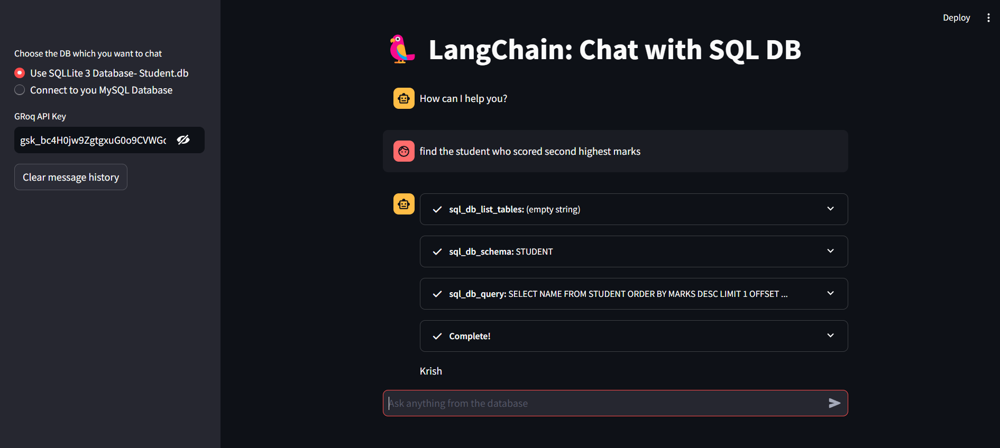

# 🗣️ LangChain SQL Chat: Chat with Your Database! 

## 🌟 Introduction
Transform your database interaction experience with this Streamlit app that lets you chat naturally with SQL databases using LangChain and Groq's LLM. No more writing complex SQL queries - just ask questions in plain English! ✨

## 🚀 Key Features
- 🔄 **Multi-Database Support**: Works with both SQLite and MySQL
- 💬 **Natural Language Queries**: Just chat - we handle the SQL magic
- 🔐 **Secure Credentials**: Your API keys and passwords are safe with us
- ⚡ **Real-time Responses**: Lightning-fast answers with Groq's Llama3-8b
- 📝 **Smart Chat**: Never lose context with conversation history

## 📋 Requirements
- 🔗 langchain
- 🌐 streamlit
- 🤖 langchain-groq
- 📊 sqlalchemy
- 🐬 mysql-connector-python (for MySQL)

## 🛠️ Installation

1. ⬇️ Clone the repository:
```bash
git clone https://github.com/Yuvraj0014/Langchain-SQL-Chat.git
cd langchain-sql-chat
```

2. 🌱 Set up virtual environment:
```bash
python -m venv venv
source venv/bin/activate  # For Unix/MacOS
venv\Scripts\activate     # For Windows
```

3. 📦 Install dependencies:
```bash
pip install -r requirements.txt
```

4. 🚀 Launch application:
```bash
streamlit run app.py
```
## 🌐 Live Demo
Too lazy to adult today? Join the club! Ditch the to-do list and dive into the Streamlight app instead. It's right here, waiting for you!
Try it now: [SmartSearch Hub App](https://langchain-sql-chat.streamlit.app/)

## 📱 Usage

1. 🔄 Choose your database:
   - 📁 SQLite (with included student.db)
   - 🐬 MySQL (connect to your own)

2. 🔑 Set up access:
   - Enter your Groq API key
   - For MySQL: Add connection details

3. 💭 Start chatting:
   - Type questions naturally
   - Watch real-time query execution
   - Track your conversation history

## 🏗️ Technical Architecture

1. 🎨 **Frontend**:
   - Beautiful Streamlit chat interface
   - Secure credential handling
   - Smart database switching
   - Live response streaming

2. ⚙️ **Backend**:
   - Powerful LangChain SQL agent
   - Advanced Groq LLM (Llama3-8b-8192)
   - Robust SQLDatabase toolkit
   - Efficient state management

## 🔒 Security Features
- 🔐 Secure session storage for credentials
- 👁️ Hidden password fields
- 📑 Read-only SQLite access
- ❌ No permanent credential storage

## 💾 Supported Databases
- 📊 SQLite 3
- 🐬 MySQL

## 💡 Use Cases
- 🔍 Explore your data naturally
- 📊 Quick data analysis
- 🎓 Learn SQL interactively
- 📚 Document your database
- ⚡ Get instant insights

## Application Interface




## 📚 Learn More
For detailed documentation:
- 🔗 LangChain: https://python.langchain.com/
- 🤖 Groq: https://docs.groq.com/
